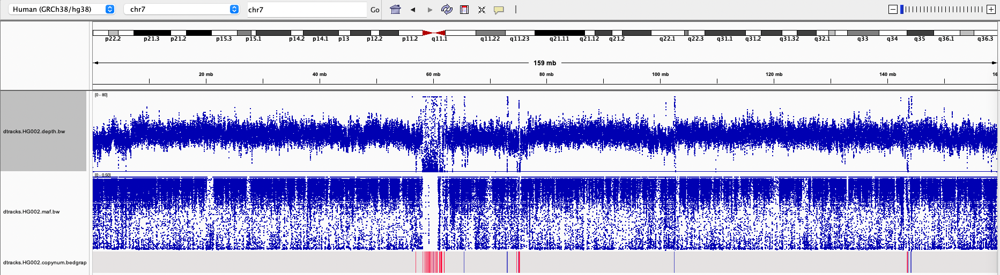

# Quickstart
```
hificnv \
    --bam {BAM} \
    --ref {REF_FASTA} \
    --exclude {EXCLUDE} \
    --expected-cn {EXPECTED_CN} \
    --threads {THREADS} \
    --output-prefix {OUTPUT_PREFIX}
```
Parameters:
* `{BAM}` - a BAM file containing reads from the sample
* `{REF_FASTA}` - a FASTA file containing the reference genome, gzip allowed
* `{EXCLUDE}` - a BED file of excluded regions, recommended for hg38: [cnv.excluded_regions.hg38.bed.gz](../data/excluded_regions/cnv.excluded_regions.hg38.bed.gz)
* `{EXPECTED_CNV}` - a BED file containing regions with deviant copy number expectations (two copy is the default if unspecified), male and female expectation files are proved in the [expected_cn](../data/expected_cn) folder
* `{THREADS}` - number of threads to use
* `{OUTPUT_PREFIX}` - the prefix for all output files

## Example

Example of running HiFiCNV on an HG002 (male) WGS sample.  An optional VCF file is provided for minor-allele frequency outputs in this example:

```
$ hificnv \
>     --bam /path/to/HG002.GRCh38.deepvariant.haplotagged.bam \
>     --maf /path/to/HG002.GRCh38.deepvariant.phased.vcf.gz \
>     --ref /path/to/human_GRCh38_no_alt_analysis_set.fasta \
>     --exclude /path/to/common_events.exclude-merged.bed.gz \
>     --expected-cn /path/to/male_ecn.bed \
>     --threads 8 \
>     --output-prefix HG002_male
[2022-09-29][06:22:57][hificnv][INFO] Starting hificnv
[2022-09-29][06:22:57][hificnv][INFO] cmdline: hificnv --bam /path/to/HG002.GRCh38.deepvariant.haplotagged.bam --ref /path/to/human_GRCh38_no_alt_analysis_set.fasta --exclude /path/to/common_events.exclude-merged.bed.gz --expected-cn /path/to/male_ecn.bed --threads 8 --output-prefix HG002_male
[2022-09-29][06:22:57][hificnv][INFO] Running on 8 threads
[2022-09-29][06:22:57][hificnv][INFO] Reading reference genome from file '/path/to/human_GRCh38_no_alt_analysis_set.fasta'
[2022-09-29][06:23:29][hificnv][INFO] Reading excluded regions from file '/path/to/common_events.exclude-merged.bed.gz'
[2022-09-29][06:23:29][hificnv][INFO] Reading expected CN regions from file '/path/to/male_ecn.bed'
[2022-09-29][06:23:29][hificnv][INFO] Processing alignment file '/path/to/HG002.GRCh38.deepvariant.haplotagged.bam'
[2022-09-29][06:37:47][hificnv][INFO] Writing depth track to bigwig file: 'HG002_male.HG002.depth.bw'
[2022-09-29][06:37:48][hificnv][INFO] Scanning minor allele frequency data from file '/path/to/HG002.GRCh38.deepvariant.phased.vcf.gz'
[2022-09-29][06:38:01][hificnv][INFO] Writing bigwig maf track to file: 'HG002_male.HG002.maf.bw'
[2022-09-29][06:38:18][hificnv][INFO] Segmenting copy number
[2022-09-29][06:38:18][hificnv][INFO] Haploid coverage estimates for sample 'HG002', iteration 1. Uncorrected: 14.955 GC-Corrected: 15.708
[2022-09-29][06:38:21][hificnv][INFO] Haploid coverage estimates for sample 'HG002', iteration 2. Uncorrected: 14.955 GC-Corrected: 15.708
[2022-09-29][06:38:23][hificnv][INFO] Writing bedgraph copy number track to file: 'HG002_male.HG002.copynum.bedgraph'
[2022-09-29][06:38:23][hificnv][INFO] Writing copy number variants to file: 'HG002_male.HG002.vcf.gz'
[2022-09-29][06:38:23][hificnv][INFO] hificnv completed. Total Runtime: 00:15:26.323
$ ls
HG002_male.HG002.copynum.bedgraph  HG002_male.HG002.depth.bw  HG002_male.HG002.maf.bw  HG002_male.HG002.vcf.gz  HG002_male.log
```

These tracks visualized in IGV appear as follows:

